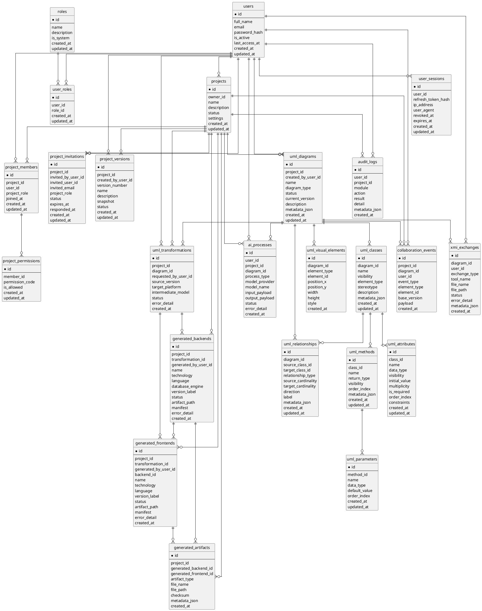

# Detalle del diagrama de base de datos general

Este documento define un unico diagrama de base de datos para todo el sistema CASE Inteligente. No se divide por caso de uso porque la base de datos es transversal a los cuatro paquetes del sistema.

El diagrama debe mostrar entidades/tablas con sus atributos, sin detallar tipos de dato. Las relaciones se dibujan por llaves foraneas y cardinalidad general.

## Alcance

Incluye las tablas persistentes detectadas en los modelos del backend:

- Gestion de acceso, usuarios y seguimiento.
- Gestion de proyectos y colaboracion.
- Modelado UML inteligente.
- Transformacion y generacion automatica de software.

## Entidades y atributos

### Acceso, usuarios y seguimiento

**users**

- id
- full_name
- email
- password_hash
- is_active
- last_access_at
- created_at
- updated_at

**roles**

- id
- name
- description
- is_system
- created_at
- updated_at

**user_roles**

- id
- user_id
- role_id
- created_at
- updated_at

**user_sessions**

- id
- user_id
- refresh_token_hash
- ip_address
- user_agent
- revoked_at
- expires_at
- created_at
- updated_at

**audit_logs**

- id
- user_id
- project_id
- module
- action
- result
- detail
- metadata_json
- created_at

### Proyectos y colaboracion

**projects**

- id
- owner_id
- name
- description
- status
- settings
- created_at
- updated_at

**project_members**

- id
- project_id
- user_id
- project_role
- joined_at
- created_at
- updated_at

**project_permissions**

- id
- member_id
- permission_code
- is_allowed
- created_at
- updated_at

**project_invitations**

- id
- project_id
- invited_by_user_id
- invited_user_id
- invited_email
- project_role
- status
- expires_at
- responded_at
- created_at
- updated_at

**project_versions**

- id
- project_id
- created_by_user_id
- version_number
- name
- description
- snapshot
- status
- created_at
- updated_at

**collaboration_events**

- id
- project_id
- diagram_id
- user_id
- event_type
- element_type
- element_id
- base_version
- payload
- created_at

### Modelado UML inteligente

**uml_diagrams**

- id
- project_id
- created_by_user_id
- name
- diagram_type
- status
- current_version
- description
- metadata_json
- created_at
- updated_at

**uml_classes**

- id
- diagram_id
- name
- visibility
- element_type
- stereotype
- description
- metadata_json
- created_at
- updated_at

**uml_attributes**

- id
- class_id
- name
- data_type
- visibility
- initial_value
- multiplicity
- is_required
- order_index
- constraints
- created_at
- updated_at

**uml_methods**

- id
- class_id
- name
- return_type
- visibility
- order_index
- metadata_json
- created_at
- updated_at

**uml_parameters**

- id
- method_id
- name
- data_type
- default_value
- order_index
- created_at
- updated_at

**uml_relationships**

- id
- diagram_id
- source_class_id
- target_class_id
- relationship_type
- source_cardinality
- target_cardinality
- direction
- label
- metadata_json
- created_at
- updated_at

**uml_visual_elements**

- id
- diagram_id
- element_type
- element_id
- position_x
- position_y
- width
- height
- style
- created_at

**xmi_exchanges**

- id
- diagram_id
- user_id
- exchange_type
- tool_name
- file_name
- file_path
- status
- error_detail
- metadata_json
- created_at

### Transformacion y generacion automatica de software

**ai_processes**

- id
- user_id
- project_id
- diagram_id
- process_type
- model_provider
- model_name
- input_payload
- output_payload
- status
- error_detail
- created_at

**uml_transformations**

- id
- project_id
- diagram_id
- requested_by_user_id
- source_version
- target_platform
- intermediate_model
- status
- error_detail
- created_at

**generated_backends**

- id
- project_id
- transformation_id
- generated_by_user_id
- name
- technology
- language
- database_engine
- version_label
- status
- artifact_path
- manifest
- error_detail
- created_at

**generated_frontends**

- id
- project_id
- transformation_id
- generated_by_user_id
- backend_id
- name
- technology
- language
- version_label
- status
- artifact_path
- manifest
- error_detail
- created_at

**generated_artifacts**

- id
- project_id
- generated_backend_id
- generated_frontend_id
- artifact_type
- file_name
- file_path
- checksum
- metadata_json
- created_at

## Relaciones principales

- users 1:N user_sessions
- users 1:N user_roles
- roles 1:N user_roles
- users 1:N projects como propietario
- users 1:N project_members
- projects 1:N project_members
- project_members 1:N project_permissions
- projects 1:N project_invitations
- users 1:N project_invitations como usuario invitador
- users 0..1:N project_invitations como usuario invitado
- projects 1:N project_versions
- users 1:N project_versions como creador de version
- projects 1:N uml_diagrams
- users 1:N uml_diagrams como creador
- uml_diagrams 1:N uml_classes
- uml_classes 1:N uml_attributes
- uml_classes 1:N uml_methods
- uml_methods 1:N uml_parameters
- uml_diagrams 1:N uml_relationships
- uml_classes 1:N uml_relationships como clase origen
- uml_classes 1:N uml_relationships como clase destino
- uml_diagrams 1:N uml_visual_elements
- uml_diagrams 1:N xmi_exchanges
- users 1:N xmi_exchanges
- projects 1:N collaboration_events
- uml_diagrams 0..1:N collaboration_events
- users 1:N collaboration_events
- users 1:N audit_logs
- projects 1:N audit_logs
- users 1:N ai_processes
- projects 0..1:N ai_processes
- uml_diagrams 0..1:N ai_processes
- projects 1:N uml_transformations
- uml_diagrams 1:N uml_transformations
- users 1:N uml_transformations como solicitante
- uml_transformations 1:N generated_backends
- uml_transformations 1:N generated_frontends
- generated_backends 0..1:N generated_frontends
- projects 1:N generated_backends
- projects 1:N generated_frontends
- projects 1:N generated_artifacts
- generated_backends 0..1:N generated_artifacts
- generated_frontends 0..1:N generated_artifacts

## Diagrama sugerido

Usar esta estructura como base para dibujar el diagrama general. Se evita incluir tipos de dato en los atributos.

